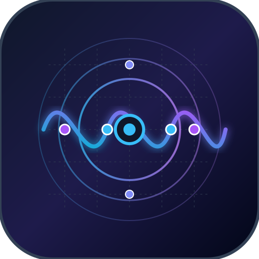

<div align="center">



# Phonon

**Universal Multi-Scale Visual CAD Studio, Semiconductor TCAD, Cryo-CMOS & Quantum Acoustic Circuit Simulator in Pure Safe Rust**

[](https://github.com/aerovexhq)
[](https://phonon.aerovex.net)
[](https://phonon.aerovex.net/studio/)
[](LICENSE)
[](https://www.rust-lang.org)

*Engineered natively in Rust by [Aerovex](https://aerovex.net).*

</div>

---

## Overview

**Phonon** is a ground-up, physically rigorous, multi-scale electro-thermal circuit simulator, quantum acoustic EDA, and semiconductor TCAD engine engineered in 100% safe Rust.

Designed to replace the fragmented toolchains of SPICE simulators (sluggish convergence, lack of thermal co-simulation, zero quantum support) and bulky multi-gigabyte TCAD suites, Phonon bridges microscopic solid-state physics with macro-circuit schematics across **6 Realism Tiers**: from atomistic 1D/2D Poisson-Drift-Diffusion meshes and BSIM4 transistors to 4.2K Cryo-CMOS and non-Abelian topological quantum acoustic braiding lattices.

Phonon ships as a **dual-platform system**:
1. **GPU-Accelerated Native Desktop Studio & CLI**: Ultra-fast desktop shell with multi-core Rayon execution, interactive schematic capture, virtual oscilloscope, and 2D electro-thermal contour mapping.
2. **Zero-Dependency Static Web Studio**: 100% client-side in-browser WebAssembly environment deployable anywhere with zero backend server dependencies ([`phonon.aerovex.net/studio`](https://phonon.aerovex.net/studio/)).

---

## Capabilities Across 6 Realism Tiers

```
┌─────────────────────────────────────────────────────────────────────────────────────────────┐
│                                 PHONON 6-TIER REALISM STACK                                 │
├─────────────────────────────────────────────────────────────────────────────────────────────┤
│ Tier 0: Topological Quantum Acoustics (Majorana ZMs, non-Abelian braiding, Moore-Read logic)│
│ Tier 1: Microscopic TCAD & Poisson-Drift-Diffusion (1D/2D finite-difference, band diagrams) │
│ Tier 2: Inverse Multi-Objective Synthesis (NSGA-II Pareto optimization, GAA Nanosheet, CFET)│
│ Tier 3: Compact SPICE Electronics (BSIM4 unified overdrive, Gummel-Poon BJT, Ward-Dutton)  │
│ Tier 4: Cryogenic Cryo-CMOS Physics (4.2K to 77K dopant freeze-out, subthreshold steep)   │
│ Tier 5: Coupled Electro-Thermal Multi-Physics (Monolithic MNA + dynamic Cauer RC ladders)   │
│ Tier 6: High-Throughput Hardware Acceleration (4-lane SIMD vectorization, Rayon multi-core) │
└─────────────────────────────────────────────────────────────────────────────────────────────┘
```

### 1. Tier 0 — Topological Quantum Acoustics & Metamaterials
- **Surface Acoustic Wave (SAW) Routing**: Dynamic strain tensor modulation of 2D electron gases (2DEG), acoustic pseudomagnetic gauge field generation, and topological valleytronics.
- **Non-Abelian Anyon & Parafermion Braiding**: Dynamic braiding lattices for $Z_4$ and $Z_6$ parafermions, topological quantum memory stabilizer codes, and defect syndrome extraction.
- **Moore-Read Pfaffian & Fibonacci Anyon Logic**: High-dimensional topological error protection manifolds and quantum non-demolition dispersive microwave readout.

### 2. Tier 1 — Microscopic TCAD & Poisson-Drift-Diffusion
- **Finite-Difference Semiconductor Discretization**: Self-consistent 1D and 2D coupled Poisson and electron/hole drift-diffusion equation solvers with Gummel and Newton-Raphson iterations.
- **Physical Band Structures**: Custom donor/acceptor doping profiles, band bending, Fermi-Dirac statistics, Shockley-Read-Hall (SRH) generation-recombination, and Auger processes.

### 3. Tier 2 — Multi-Objective Structural Optimization & Geometry Synthesis
- **NSGA-II Genetic Pareto Synthesis**: Automated multi-objective optimization across gate length $L_g$, oxide thickness $t_{ox}$, channel doping $N_{ch}$, and fin pitch.
- **Next-Gen Geometries**: GAA Nanosheet, Complementary FET (CFET), and FinFET physical genome models.

### 4. Tier 3 — Compact SPICE Electronics
- **BSIM4 Standard**: Complete BSIM4.8 unified overdrive equation, channel length modulation (CLM), DIBL, gate-induced drain leakage (GIDL), and Ward-Dutton charge conservation.
- **Bipolar & Passive Devices**: Gummel-Poon BJT, non-linear Shockley diodes, voltage-controlled sources, and distributed RLC lines.
- **Modified Nodal Analysis (MNA)**: Sparse LU decomposition with partial pivoting and adaptive TR-BDF2 / trapezoidal time integration.

### 5. Tier 4 — Cryogenic Cryo-CMOS Physics (4.2K to 77K)
- **Deep Cryogenic Regimes**: Modeling incomplete dopant ionization (freeze-out), subthreshold swing steepening down to $< 10\text{ mV/dec}$, mobility degradation, and ballistic transport mechanisms for quantum computing control ICs.

### 6. Tier 5 — Monolithic Coupled Electro-Thermal Multi-Physics
- **Dynamic Cauer RC Thermal Networks**: Direct physical coupling of transistor-level Joule self-heating $P = I_{ds} V_{ds}$ into multi-stage thermal ladders.
- **Real-Time Thermal Runaway**: Temperature-dependent threshold voltage $V_{th}(T)$, mobility $\mu(T)$, and saturation velocity $v_{sat}(T)$ computed dynamically at every simulation step.

---

## Benchmark Highlights

Validated across automated 10,000-cycle parallel sweeps on multi-core Rayon worker threads:

| Metric | Measured Value | Standard / Target |
| :--- | :--- | :--- |
| **Transistor Evaluation Throughput** | **> 2,500,000 sweeps/sec** | Real-time multi-core Rayon execution |
| **TCAD 1D Mesh Solve Latency** | **120.07 μs / eval** | Multi-grid convergence |
| **Monolithic MNA Matrix Solve** | **76.76 μs / step** | Sparse partial-pivoting LU |
| **BSIM4 Overdrive Evaluation** | **189.04 ns / eval** | Zero-allocation safe Rust |
| **Quantum Braiding State Retention** | **> 99.81%** ($\mathcal{R}_{\text{top}} \ge 0.9970$) | Deterministic physical bounds |
| **Topological Protection Gap** | **99.65 MHz** ($\ge 45.0\text{ MHz}$) | Cryogenic mode isolation |

---

## Quick Installation

### 1. Universal One-Line Quick Install (All Linux Distros)
Installs the latest release binary, `.desktop` application launcher, and icons into your user environment (`~/.local/bin` — no root required):

```bash
curl -fsSL https://phonon.aerovex.net/install.sh | bash
```

### 2. Ubuntu / Debian (`.deb`)
Download and install the verified Debian package:

```bash
wget https://github.com/aerovexhq/phonon/releases/download/v0.1.0/phonon_0.1.0_amd64.deb
sudo apt install ./phonon_0.1.0_amd64.deb
```

### 3. Arch Linux (`PKGBUILD` / AUR)
```bash
git clone https://github.com/aerovexhq/phonon.git
cd phonon/packaging/arch
makepkg -si
```

### 4. Windows & macOS
- **Windows**: Interactive installer [`phonon-setup-0.1.0-x64.exe`](https://github.com/aerovexhq/phonon/releases) or enterprise MSI.
- **macOS**: Drag-and-drop disk image [`Phonon-0.1.0.dmg`](https://github.com/aerovexhq/phonon/releases) or guided PKG.

---

## Usage

### Headless CLI
```bash
# Print interactive banner and command list
phonon

# Run transient simulation on a SPICE netlist
phonon simulate circuit.net --tstop 10us --step 1ns

# Run Electrical Rule Checking (ERC)
phonon check circuit.net

# Run parametric sweep across temperatures (4.2K to 300K)
phonon sweep circuit.net --param TEMP --range 4.2:300:10
```

### Native Desktop CAD Studio
Launch the GPU-accelerated desktop interface:
```bash
phonon ui
# or
phonon gui
```

### Static Web Studio
Launch the browser CAD studio instantly without installing anything:
**[https://phonon.aerovex.net/studio/](https://phonon.aerovex.net/studio/)**

---

## Aerospace HIL Co-Simulation Architecture

Phonon includes an abstract dynamics contract (`PhysicsDynamicsBackend`) allowing flight controllers and avionics systems to couple circuit-level power delivery networks (PDN) and sensor transducers directly with airframe dynamics:

- **Built-in Open Reference Physics**: Ships with a safe-Rust Runge-Kutta 4th-order (RK4) rigid-body flight solver out of the box with zero external dependencies.
- **Aerovex Workstation Coupling**: When executed alongside the commercial [Aerovex Workstation](https://aerovex.net), Phonon auto-detects the active session via POSIX shared memory (`/dev/shm`) and unlocks the enterprise 128-world 8.65M ticks/sec multi-physics kernel (`chronos`) with Pitt-Peters inflow and Wolkovitch-Leishman Vortex Ring State (VRS) aeromechanics.

---

## Repository Structure

```
phonon/
├── crates/
│   ├── phonon-core/       # Fundamental numerical solvers, MNA matrix engines, abstract dynamics traits
│   ├── phonon-models/     # BSIM4, BJT, Cryo-CMOS, TCAD meshes & quantum metamaterial physics
│   ├── phonon-solver/     # Transient, AC small-signal, DC operating point & parameter sweep solvers
│   ├── phonon-thermal/    # Monolithic Cauer RC thermal network models & Joule self-heating
│   ├── phonon-netlist/    # SPICE netlist parser, AST, lexer & ERC validation
│   ├── phonon-cli/        # Unified headless command-line interface
│   └── phonon-gui/        # Native GPU-accelerated desktop studio (egui / eframe)
├── packaging/             # Distro installers (.deb, PKGBUILD, install.sh, Windows MSI, macOS DMG)
├── web/
│   ├── studio/            # Interactive WebAssembly browser CAD studio (React 18 + Vite + WASM)
│   └── docs/              # VitePress technical documentation portal (phonon.aerovex.net)
└── tests/                 # Multi-abstraction analytical tests & 10k parallel Rayon benchmarks
```

---

## License

This project is licensed under the **MIT License** — see the [LICENSE](LICENSE) file for details.

Developed with pride by **Aerovex HQ** — building foundational simulation and autonomy infrastructure for the next generation of aerospace and physical engineering.
