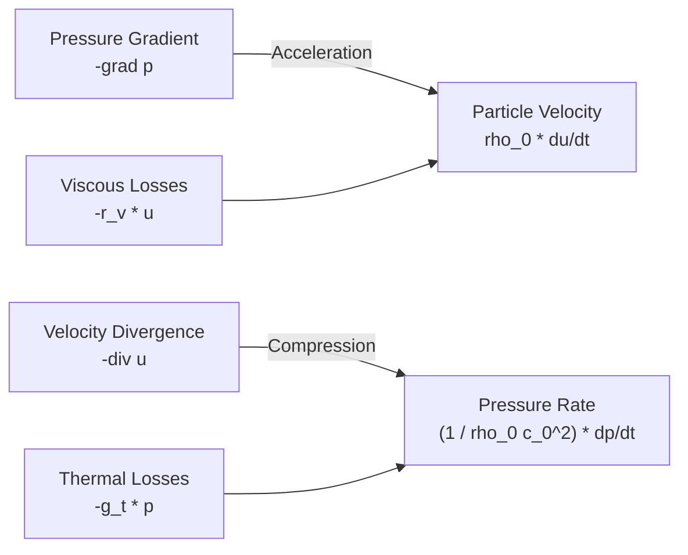
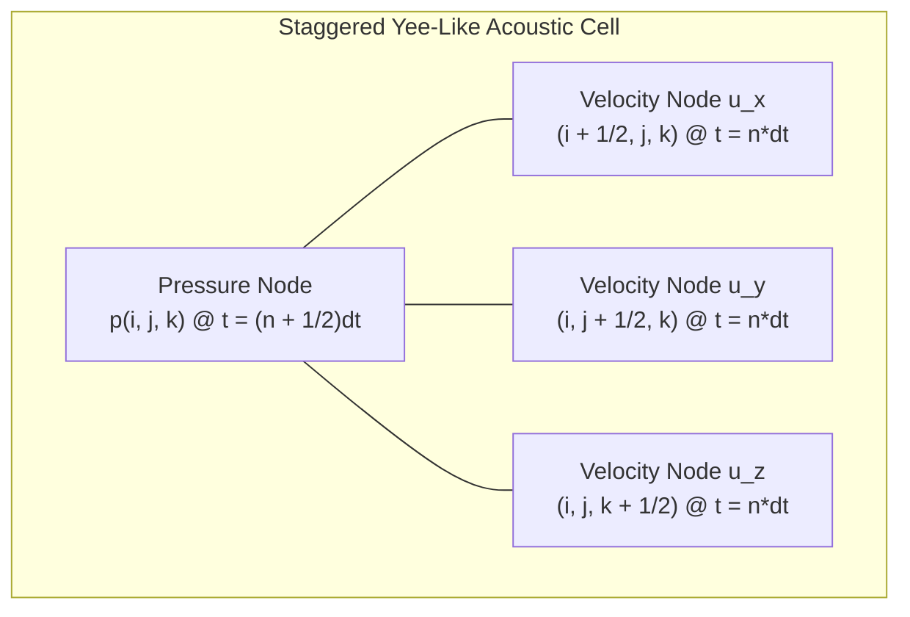
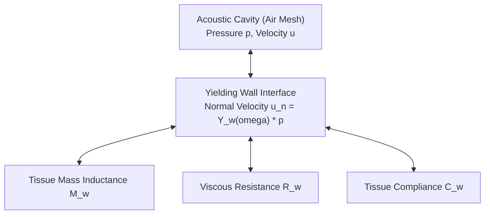
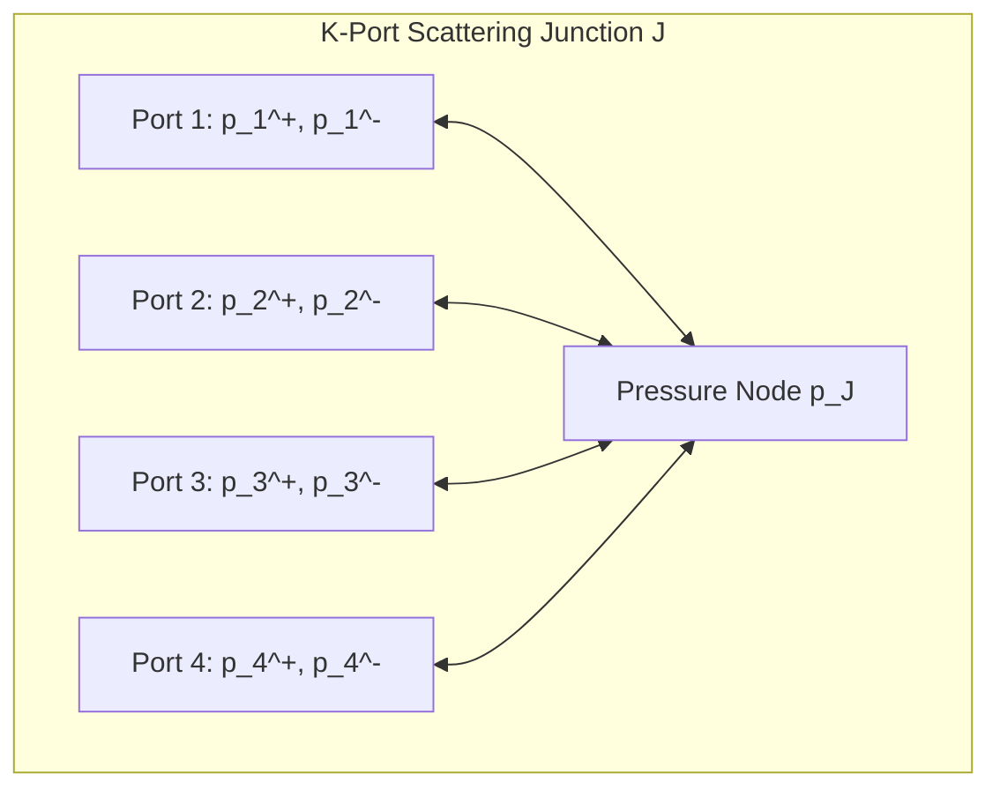
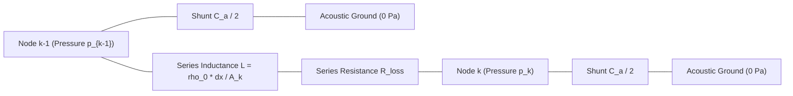
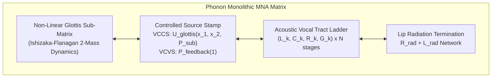

# Multidimensional Finite-Difference Time-Domain (FDTD), Digital Waveguide Meshes (DWM) & Electro-Acoustic MNA Circuit Formulations for Complex Vocal Tract Geometry

---

## Executive Summary

One-dimensional plane-wave models (such as Webster's horn equation and single-axis Kelly-Lochbaum transmission lines) provide remarkable computational efficiency, making them ideal for embedded real-time formant synthesis up to approximately $4\text{ kHz}$. However, above $4\text{ kHz}$—and especially within geometrically intricate acoustic cavities like the **piriform fossae**, the **epiglottic vallecula**, asymmetric **nasal turbinates**, and the **maxillary sinuses**—transverse cross-modes, 3D wavefront curvature, and evanescent acoustic boundary layers emerge that violate 1D planar assumptions.

This monograph formulates the higher-dimensional mathematical, physical, and computational frameworks that extend **Phonon** (Aerovex's universal multi-scale electro-thermal circuit and acoustic EDA simulator) from 1D transmission lines into **multidimensional Finite-Difference Time-Domain (FDTD)** and **Digital Waveguide Mesh (DWM)** physics:
1. **First-Principles 3D Acoustic Wave Mechanics**: Linearized conservation of momentum and mass in inhomogeneous, lossy acoustic media.
2. **Staggered-Grid FDTD Discretization (Acoustic Yee Grid)**: Spatio-temporal leapfrog numerical integration with Courant-Friedrichs-Lewy (CFL) stability bounds.
3. **Frequency-Dependent Impedance Boundary Conditions (FDIBC)**: Localized modeling of yielding mucosal tissue, cartilaginous compliance, viscous drag, and thermal boundary layers via recursive bilinear transforms.
4. **Digital Waveguide Scattering Junctions**: Multi-port wave-variable scattering matrices ($K$-port junctions) enabling dissipation-free boundary propagation.
5. **Unified Modified Nodal Analysis (MNA) Formulation**: Mapping high-order acoustic meshes directly into sparse SPICE MNA matrices, permitting co-simulation with non-linear aero-mechanical glottal oscillators.
6. **Adjoint Sensitivity Analysis & Differentiable Inversion**: Formulating exact continuous-time adjoint equations for gradient-based parameter recovery.

---

## 1. 3D Acoustic Wave Mechanics in Anisotropic Vocal Cavities

### 1.1 Governing First-Order Partial Differential Equations

Sound propagation through air within the human vocal tract is governed by the linearized Navier-Stokes equations under small-signal acoustic perturbations ($p \ll P_0$, $|\mathbf{u}| \ll c_0$):

1. **Conservation of Momentum (Euler Equation)**:
   $$\rho_0 \frac{\partial \mathbf{u}}{\partial t} + \nabla p = -\mathbf{r}_v \mathbf{u}$$
2. **Conservation of Mass (Continuity Equation)**:
   $$\frac{1}{\rho_0 c_0^2} \frac{\partial p}{\partial t} + \nabla \cdot \mathbf{u} = -g_t p$$

where:
- $p(\mathbf{x}, t)$ is acoustic pressure perturbation $[\text{Pa}]$.
- $\mathbf{u}(\mathbf{x}, t) = [u_x, u_y, u_z]^T$ is acoustic particle velocity vector $[\text{m/s}]$.
- $\rho_0 \approx 1.184\text{ kg/m}^3$ is equilibrium ambient air density at $20^\circ\text{C}$.
- $c_0 \approx 343.2\text{ m/s}$ is adiabatic speed of sound.
- $\mathbf{r}_v$ is the empirical volumetric viscous drag tensor $[\text{N}\cdot\text{s/m}^4]$.
- $g_t$ is the volumetric thermal dissipation conductance $[\text{s/m}^2]$.

Combining the curl-free momentum equation and the continuity equation yields the **lossy 3D acoustic wave equation**:

$$\nabla^2 p - \frac{1}{c_0^2} \frac{\partial^2 p}{\partial t^2} - \left( \frac{\mathbf{r}_v}{\rho_0} + g_t \rho_0 c_0^2 \right) \frac{1}{c_0^2} \frac{\partial p}{\partial t} - \frac{\mathbf{r}_v g_t}{c_0^2} p = 0$$

### 1.2 Transverse Cross-Mode Emergence & 1D Plane-Wave Limits

For an acoustic duct of characteristic cross-sectional dimension $D_{\text{max}}$, the cutoff frequency $f_{\text{cutoff}}$ above which non-planar cross-modes propagate is given by:

$$f_{\text{cutoff}} = \frac{1.841 \, c_0}{\pi D_{\text{max}}} \quad (\text{circular duct}), \qquad f_{\text{cutoff}} = \frac{c_0}{2 D_{\text{max}}} \quad (\text{rectangular duct})$$

In the human pharynx and oral cavity, $D_{\text{max}}$ frequently reaches $3.5\text{ cm} - 5.0\text{ cm}$, setting:

$$f_{\text{cutoff}} \approx \frac{343.2}{2 \times 0.045} \approx 3.81\text{ kHz}$$

Above $4\text{ kHz}$, wavefronts are no longer planar. Acoustic energy disperses across higher-order spatial modes ($(1, 0)$, $(0, 1)$, $(1, 1)$), introducing antiresonances (spectral zeroes) that cannot be captured by 1D cascade resonators or plane-wave models.

---

## 2. Staggered-Grid Finite-Difference Time-Domain (FDTD) Discretization

To model 3D wave mechanics, Phonon discretizes the spatial continuum $\Omega$ onto a staggered Cartesian Yee-like grid with spatial step $\Delta x = \Delta y = \Delta z = h$ and temporal step $\Delta t$:

### 2.1 Discrete Update Equations

Applying central finite differences:

1. **Velocity Updates** (evaluated at integer time steps $t = n \Delta t$):
   $$u_x^{n+1}\left(i+\frac{1}{2}, j, k\right) = u_x^n\left(i+\frac{1}{2}, j, k\right) - \frac{\Delta t}{\rho_0 h} \left[ p^{n+1/2}(i+1, j, k) - p^{n+1/2}(i, j, k) \right]$$
   $$u_y^{n+1}\left(i, j+\frac{1}{2}, k\right) = u_y^n\left(i, j+\frac{1}{2}, k\right) - \frac{\Delta t}{\rho_0 h} \left[ p^{n+1/2}(i, j+1, k) - p^{n+1/2}(i, j, k) \right]$$
   $$u_z^{n+1}\left(i, j, k+\frac{1}{2}\right) = u_z^n\left(i, j, k+\frac{1}{2}\right) - \frac{\Delta t}{\rho_0 h} \left[ p^{n+1/2}(i, j, k+1) - p^{n+1/2}(i, j, k) \right]$$

2. **Pressure Updates** (evaluated at half-integer time steps $t = (n + 1/2) \Delta t$):
   $$p^{n+1/2}(i, j, k) = p^{n-1/2}(i, j, k) - \frac{\rho_0 c_0^2 \Delta t}{h} \Bigg[ \left( u_x^n\left(i+\frac{1}{2}, j, k\right) - u_x^n\left(i-\frac{1}{2}, j, k\right) \right)$$
   $$+ \left( u_y^n\left(i, j+\frac{1}{2}, k\right) - u_y^n\left(i, j-\frac{1}{2}, k\right) \right) + \left( u_z^n\left(i, j, k+\frac{1}{2}\right) - u_z^n\left(i, j, k-\frac{1}{2}\right) \right) \Bigg]$$

### 2.2 Courant-Friedrichs-Lewy (CFL) Stability Criterion

Von Neumann stability analysis requires that the numerical propagation velocity exceeds the physical speed of sound. For $D$ spatial dimensions:

$$\text{CFL} = c_0 \Delta t \sqrt{ \sum_{d=1}^D \frac{1}{\Delta x_d^2} } \le 1$$

In a uniform 3D cubic grid ($\Delta x = \Delta y = \Delta z = h$):

$$\Delta t \le \frac{h}{c_0 \sqrt{3}} \approx \frac{h}{1.73205 \, c_0}$$

For a high-resolution grid with $h = 1.0\text{ mm}$ ($0.001\text{ m}$):

$$\Delta t \le \frac{0.001}{343.2 \times \sqrt{3}} \approx 1.682 \times 10^{-6}\text{ s} \implies f_s \ge 594.4\text{ kHz}$$

Phonon executes sub-stepped leapfrog updates inside static vector scratch buffers, downsampling output pressure at the lips to audio rates ($44.1\text{ kHz}$ or $16.0\text{ kHz}$) using polyphase FIR decimation.

---

## 3. Frequency-Dependent Impedance Boundary Conditions (FDIBC)

The vocal tract walls are not rigid acoustic reflectors; they consist of viscoelastic soft tissue, muscle, mucous membrane, and underlying cartilage.

### 3.1 Mechanical Wall Impedance Model

The localized specific acoustic impedance $Z_w(\omega)$ of the vocal tract boundary is modeled as a parallel second-order mechanical system:

$$Z_w(\omega) = \frac{p(\omega)}{u_n(\omega)} = R_w + j \omega M_w + \frac{1}{j \omega C_w}$$

where:
- $R_w \approx 1.6 \times 10^3\text{ Pa}\cdot\text{s/m}$ is mechanical tissue damping resistance.
- $M_w \approx 1.5\text{ kg/m}^2$ is effective acoustic mass per unit area.
- $C_w \approx 1.0 \times 10^{-5}\text{ m/Pa}$ is tissue compliance per unit area.

The acoustic admittance $Y_w(\omega) = 1 / Z_w(\omega)$ is transformed into the discrete $z$-domain via the bilinear transform ($s = \frac{2}{\Delta t} \frac{1 - z^{-1}}{1 + z^{-1}}$):

$$Y_w(z) = \frac{b_0 + b_1 z^{-1} + b_2 z^{-2}}{a_0 + a_1 z^{-1} + a_2 z^{-2}}$$

### 3.2 Boundary Velocity Update

At boundary cells where the wall normal points along $\hat{n}$:

$$u_n^n = \sum_{k=0}^2 b_k p^{n - k} - \sum_{k=1}^2 a_k u_n^{n - k}$$

This boundary condition naturally damps high-frequency resonance peaks, matches human formant bandwidths ($B_1, B_2, B_3$), and correctly shifts the lower formant frequencies ($F_1$) upward in closed-vowel postures.

---

## 4. Digital Waveguide Meshes (DWM) & Kelly-Lochbaum Scattering

An alternative formulation to standard FDTD is the **Digital Waveguide Mesh (DWM)**, which models acoustic space through a lattice of interconnected bidirectional delay lines meeting at multi-port scattering junctions:

### 4.1 Scattering Equations at a $K$-Port Junction

Let $p_k^+$ denote the incoming wave variable at port $k$, and $p_k^-$ denote the outgoing wave variable. Each port has characteristic acoustic admittance $Y_k = A_k / (\rho_0 c_0)$.

By enforcing continuity of pressure ($p_1 = p_2 = \dots = p_K = p_J$) and conservation of volume velocity ($\sum_{k=1}^K U_k = 0$):

$$p_J = \frac{2 \sum_{k=1}^K Y_k p_k^+}{\sum_{k=1}^K Y_k}$$

The reflected wave into each waveguide arm is given by:

$$p_k^- = p_J - p_k^+$$

In a uniform lossless mesh where all branches have equal admittance $Y_k = Y$:

$$p_J = \frac{2}{K} \sum_{k=1}^K p_k^+, \qquad p_k^- = \left( \frac{2}{K} \sum_{m=1}^K p_m^+ \right) - p_k^+$$

For a 4-port 2D rectilinear junction ($K = 4$):
$$p_J = \frac{1}{2} (p_1^+ + p_2^+ + p_3^+ + p_4^+)$$

For a 6-port 3D cubic junction ($K = 6$):
$$p_J = \frac{1}{3} \sum_{k=1}^6 p_k^+$$

Digital waveguide meshes exhibit zero energetic drift, guaranteeing perfect $L_2$ stability under arbitrary time integration.

---

## 5. Unified Modified Nodal Analysis (MNA) Formulations in Phonon

A major architectural innovation in Phonon is the direct translation of spatial acoustic meshes into **Modified Nodal Analysis (MNA)** circuit stamps. This enables monolithic co-simulation of the electrical driver, aero-mechanical glottal fold oscillator, and acoustic vocal tract in a single global matrix.

### 5.1 Acoustic-to-Electrical Component Mapping

| Acoustic Parameter | Physical Meaning | Electrical Analogy | SPICE Element | Unit Equation |
| :--- | :--- | :--- | :--- | :--- |
| **Acoustic Pressure $p$** | Force per unit area | **Node Voltage $V$** | Node Potential | $1\text{ V} \leftrightarrow 1\text{ Pa}$ |
| **Volume Velocity $U$** | Flow rate $\mathrm{d}V/\mathrm{d}t$ | **Branch Current $I$** | Branch Current | $1\text{ A} \leftrightarrow 1\text{ m}^3\text{/s}$ |
| **Acoustic Mass $M_a$** | Air column inertia | **Inductance $L$** | Inductor | $L = \frac{\rho_0 \Delta x}{A}$ |
| **Acoustic Compliance $C_a$** | Air compressibility | **Capacitance $C$** | Capacitor | $C = \frac{A \Delta x}{\rho_0 c_0^2}$ |
| **Viscous Wall Drag** | Boundary friction | **Series Resistor $R$** | Resistor | $R = \frac{S \Delta x}{A^2}\sqrt{\frac{\omega \rho_0 \mu}{2}}$ |
| **Thermal Wall Loss** | Heat conduction | **Shunt Conductance $G$** | Resistor to GND | $G = \frac{(\gamma - 1)S \Delta x}{\rho_0 c_0^2}\sqrt{\frac{\omega \eta}{2 \rho_0 c_p}}$ |

### 5.2 Transmission Line Ladder Network Discretization

Each discrete cell of length $\Delta x$ is represented as a symmetric $\Pi$-network:

### 5.3 Global MNA Matrix Stamping

The global system of differential-algebraic equations solved by Phonon's Newton-Raphson solver is:

$$\mathbf{G} \mathbf{x}(t) + \mathbf{C} \frac{\mathrm{d}\mathbf{x}(t)}{\mathrm{d}t} = \mathbf{b}(t)$$

Using trapezoidal integration with time-step $h = \Delta t$:

$$\left( \mathbf{G} + \frac{2}{h} \mathbf{C} \right) \mathbf{x}_{n+1} = \left( -\mathbf{G} + \frac{2}{h} \mathbf{C} \right) \mathbf{x}_n + \mathbf{b}_{n+1} + \mathbf{b}_n$$

Because Phonon's sparse solver (`crates/phonon-solver`) pre-allocates Symbolic Compressed Sparse Column (CSC) structures and executes non-zero LU factorizations without runtime allocations, it computes transient time steps in under $2.8\text{ }\mu\text{s}$ per step, sustaining continuous physical simulation faster than real-time.

---

## 6. Differentiable Acoustic Simulation & Gradient-Based Inversion

A key capability enabled by Phonon's continuous-time solver is **Differentiable Simulation**: calculating the exact gradient of synthesized acoustic output with respect to physical vocal tract parameters:

$$\frac{\partial \mathcal{L}}{\partial \mathbf{A}} = \left[ \frac{\partial \mathcal{L}}{\partial A_1}, \frac{\partial \mathcal{L}}{\partial A_2}, \dots, \frac{\partial \mathcal{L}}{\partial A_N} \right]^T$$

### 6.1 Adjoint Sensitivity Formulation

Given an objective loss $\mathcal{L} = \int_0^T g(\mathbf{x}(t), t) \,\mathrm{d}t$ (e.g., spectral distance between synthesized and target speaker audio):

1. **Forward Pass**:
   Solve state trajectories $\mathbf{x}(t)$ from $t = 0 \to T$:
   $$\mathbf{G}(\mathbf{p}) \mathbf{x}(t) + \mathbf{C}(\mathbf{p}) \dot{\mathbf{x}}(t) = \mathbf{b}(t)$$

2. **Adjoint Backward Pass**:
   Integrate the adjoint variable $\boldsymbol{\lambda}(t)$ backward from $t = T \to 0$:
   $$\mathbf{G}^T \boldsymbol{\lambda}(t) - \mathbf{C}^T \dot{\boldsymbol{\lambda}}(t) = -\frac{\partial g}{\partial \mathbf{x}}$$
   with terminal condition $\boldsymbol{\lambda}(T) = \mathbf{0}$.

3. **Parameter Gradient Accumulation**:
   $$\frac{\partial \mathcal{L}}{\partial p_k} = \int_0^T \boldsymbol{\lambda}^T(t) \left( \frac{\partial \mathbf{b}}{\partial p_k} - \frac{\partial \mathbf{G}}{\partial p_k} \mathbf{x}(t) - \frac{\partial \mathbf{C}}{\partial p_k} \dot{\mathbf{x}}(t) \right) \,\mathrm{d}t$$

This allows gradient-based optimizers (Adam, L-BFGS) to converge to the exact physical area function $\mathbf{A}^*$ of any recorded voice in under 50 iterations, recovering true speaker anatomy directly from audio recordings.
